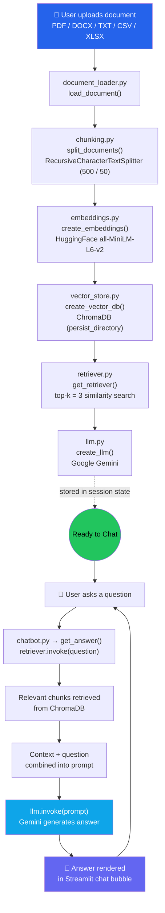
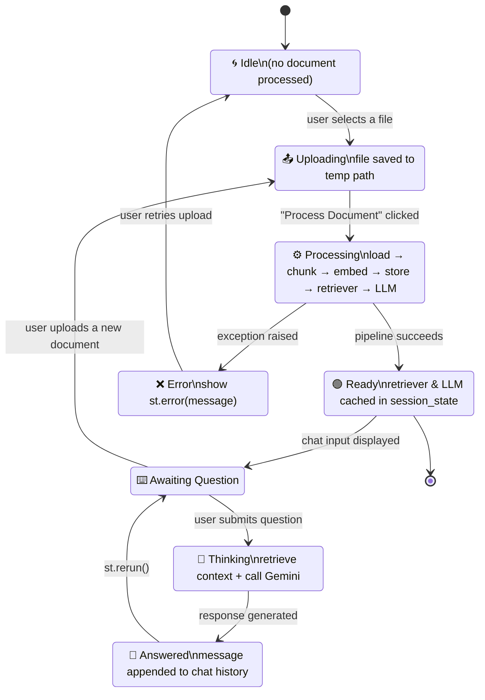

<div align="center">

# 🤖 AI RAG Chatbot

**Chat with your own documents — powered by Retrieval-Augmented Generation**

[](https://www.python.org/)
[](https://streamlit.io/)
[](https://www.langchain.com/)
[](https://www.trychroma.com/)
[](https://ai.google.dev/)
[](#license)

</div>

---

## 📖 Overview

**AI RAG Chatbot** is a Retrieval-Augmented Generation (RAG) application that lets you upload a document — PDF, DOCX, TXT, CSV, or XLSX — and have a natural conversation with it. Instead of relying purely on an LLM's built-in knowledge, the app retrieves the most relevant passages from *your* document and feeds them to the model as grounded context, producing answers that are accurate, source-based, and free of hallucinated facts wherever possible.

The project has two entry points:

- **`main.py`** — a lightweight command-line demo that loads a sample PDF (`data/Ai_Research.pdf`) and answers a single question.
- **`app.py`** — a full **Streamlit** web app with document upload, a styled chat interface, and session-based conversation history.

---

## ✨ Features

- 📄 **Multi-format ingestion** — PDF, DOCX, TXT, CSV, and XLSX supported out of the box
- ✂️ **Smart chunking** — recursive character-based text splitting with overlap to preserve context
- 🧠 **Semantic embeddings** — Hugging Face `sentence-transformers/all-MiniLM-L6-v2`
- 🗂️ **Persistent vector storage** — documents are embedded and stored in a local **ChromaDB** instance
- 🔍 **Top-k semantic retrieval** — pulls the most relevant chunks for every query
- 💬 **Grounded generation** — **Google Gemini** answers strictly from retrieved context
- 🖥️ **Polished chat UI** — dark-themed Streamlit interface with chat bubbles, avatars, and status indicators
- ⚡ **Simple, modular codebase** — each RAG stage lives in its own file under `src/`

---

## 🧭 Workflow Diagram

The diagram below shows the end-to-end pipeline — from document upload to a grounded chatbot answer.



**Pipeline stages explained:**

| Stage | Module | Responsibility |
|---|---|---|
| 1. Load | `src/document_loader.py` | Detects file type and loads it via the matching LangChain loader (`PyPDFLoader`, `Docx2txtLoader`, `TextLoader`, `CSVLoader`, `UnstructuredExcelLoader`) |
| 2. Chunk | `src/chunking.py` | Splits documents into overlapping 500-character chunks for better retrieval granularity |
| 3. Embed | `src/embeddings.py` | Converts chunks into dense vector embeddings using a Hugging Face sentence-transformer |
| 4. Store | `src/vector_store.py` | Persists embeddings in a local ChromaDB collection |
| 5. Retrieve | `src/retriever.py` | Fetches the top-3 most semantically similar chunks for a given question |
| 6. Generate | `src/llm.py` + `src/chatbot.py` | Builds a context-grounded prompt and calls Gemini to produce the final answer |

---

## 🔄 State Diagram

This state diagram models the chatbot session's lifecycle inside the Streamlit app (`app.py`).



---

## 🖼️ Output Screenshots

Screenshots of the running Streamlit application are available in the [`Streamlit Screenshots/`](./Streamlit%20Screenshots) folder of this repository.

<div align="center">

**Home screen — before any document is uploaded**


**Document uploaded and processed**


**Conversation in progress**


**Grounded answer returned from the document**


**Extended chat history view**


</div>

> 💡 If the images don't render, make sure the `Streamlit Screenshots` folder (with that exact name, including the space) stays at the root of the repository, alongside this `README.md`.

---

## 🗂️ Project Structure

```
AI_RAG-CHATBOT/
├── app.py                     # Streamlit web application (chat UI)
├── main.py                    # CLI demo — single-question RAG example
├── requirements.txt           # Python dependencies
├── .gitignore
├── data/
│   └── Ai_Research.pdf        # Sample document used by main.py
├── src/
│   ├── document_loader.py     # Multi-format document loading
│   ├── chunking.py            # Text splitting into chunks
│   ├── embeddings.py          # Hugging Face embedding model
│   ├── vector_store.py        # ChromaDB vector store creation
│   ├── retriever.py           # Top-k retriever
│   ├── llm.py                 # Gemini LLM initialization
│   ├── prompts.py             # RAG prompt template
│   ├── chatbot.py             # Retrieval + generation orchestration
│   └── memory.py              # In-memory chat history helper
└── Streamlit Screenshots/     # UI output screenshots
    ├── RAG streamlit1.png
    ├── RAG streamlit 2.png
    ├── RAG streamlit 3.png
    ├── RAG streamlit 4.png
    └── RAG streamlit 5.png
```

---

## 🛠️ Tech Stack

| Layer | Technology |
|---|---|
| UI | Streamlit |
| Orchestration | LangChain |
| Embeddings | Hugging Face `sentence-transformers/all-MiniLM-L6-v2` |
| Vector Database | ChromaDB |
| LLM | Google Gemini (`langchain-google-genai`) |
| Document Parsing | `pypdf`, `python-docx`, `pandas`, `openpyxl`, `unstructured` |
| Language | Python 3.10+ |

---

## ⚙️ Installation

### 1. Clone the repository

```bash
git clone https://github.com/Omajamshed/AI_RAG-CHATBOT.git
cd AI_RAG-CHATBOT
```

### 2. Create a virtual environment (recommended)

```bash
python -m venv venv
source venv/bin/activate      # On Windows: venv\Scripts\activate
```

### 3. Install dependencies

```bash
pip install -r requirements.txt
```

### 4. Configure your API key

Create a `.env` file in the project root:

```env
GOOGLE_API_KEY=your_google_gemini_api_key_here
```

> ⚠️ **Security note:** `src/llm.py` currently references the API key directly in code. For any real or shared deployment, load it from the environment instead, e.g.:
> ```python
> import os
> from dotenv import load_dotenv
> load_dotenv()
> llm = ChatGoogleGenerativeAI(
>     model="gemini-3.6-flash",
>     google_api_key=os.getenv("GOOGLE_API_KEY")
> )
> ```
> Never commit real API keys to version control.

---

## ▶️ Usage

### Run the Streamlit app

```bash
streamlit run app.py
```

Then open the local URL shown in the terminal (typically `http://localhost:8501`), upload a document, click **Process Document**, and start chatting.

### Run the CLI demo

```bash
python main.py
```

This loads the bundled `data/Ai_Research.pdf`, prompts you for a question in the terminal, and prints the generated answer.

---

## 🔮 Roadmap

- [ ] Move the Gemini API key to environment variables (`.env`) across the codebase
- [ ] Add conversational memory so follow-up questions retain prior context
- [ ] Support multi-document upload and cross-document retrieval
- [ ] Add source citations (page/section) alongside generated answers
- [ ] Deploy a hosted demo (Streamlit Community Cloud / Hugging Face Spaces)

---

## 🤝 Contributing

Contributions are welcome! Feel free to open an issue or submit a pull request for bug fixes, new loaders, UI improvements, or additional LLM/embedding backends.

---

## 📄 License

This project is licensed under the **MIT License**.

---

<div align="center">

Built with ❤️ using LangChain, ChromaDB, Hugging Face, and Google Gemini.

</div>
